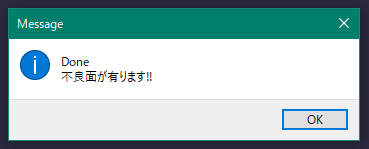

# PowerMill-Find_Surface_Clearance
これは、オートデスクソフトウェア「PowerMill」のマクロです。

取り込んだCADデータの不良面(Bad Surfaces)の検索と、面の隙間の検索を行います。
不良面となるデータのサンプルは[こちら](https://grabcad.com/library/powermill_badsurfces_example-1)にあります。

### インストール:
[こちら](http://help.autodesk.com/view/PWRM/2020/JPN/?guid=GUID-68932D88-863A-407C-91CA-C9C82CB4A99D)の手順に従ってください。

### 使用法:
1. マクロをスタートします。

1. 最初にチェック対象のモデルを選択します。（複数選択可）

1. サーフェス方向を統一させる処理の有無を選択します。

1. 不良面チェックを行うためのトレランスを入力してください。（カンマ区切りの複数値入力可）
　入力するトレランスは、ツールパスで使用されるトレランスと同一の値をチェックした方が
　よろしかと思います。（特に大きな値はチェックした方が良いと思います）

1. 面同士の隙間をチェックするトレランスを入力してください。

1. 最後に選択・入力値が表示されます。「はい」を選択することで処理を開始します。

1. 処理終了後、不良面がある場合は警告のダイアログを表示します。
　後の作業の障害となるため、削除をお勧めします。
　削除後はレベル[Bad Surfaces]は空であっても削除してください。

1. バウンダリ内に隙間をチェックしたものが、以下の名称で作成されます。
　[モデル名]_Checked-Tol_[チェック時のトレランス]
　必要に応じては、面の追加・削除を行ってください。

1. 手を抜かずに、納得出来るレベルまで以上の作業を繰り返します。

### 特徴：
作業を行う最初の確認作業を、手軽に短時間で提供。

### アクション:
以下の環境で確認しています。
 + Autodesk PowerMill Standard 2020.1.0.2020113
 + Windows10 64bit Pro

### ライセンス:
+ MIT

### 謝辞:
+ 日本サポートさん、いつもありがとう御座います
